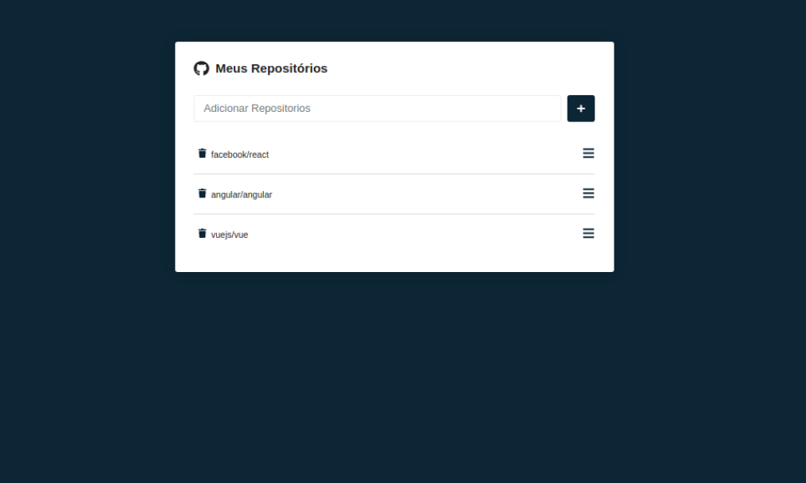
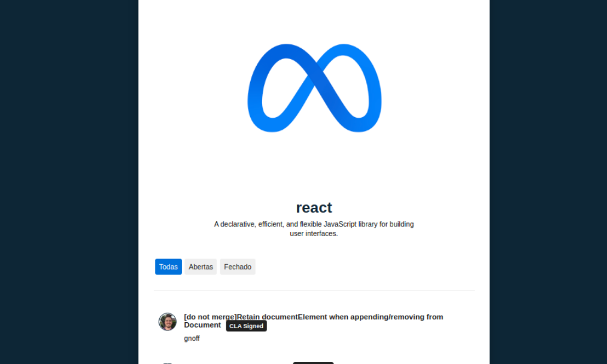
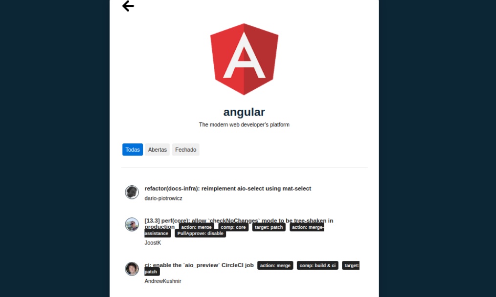
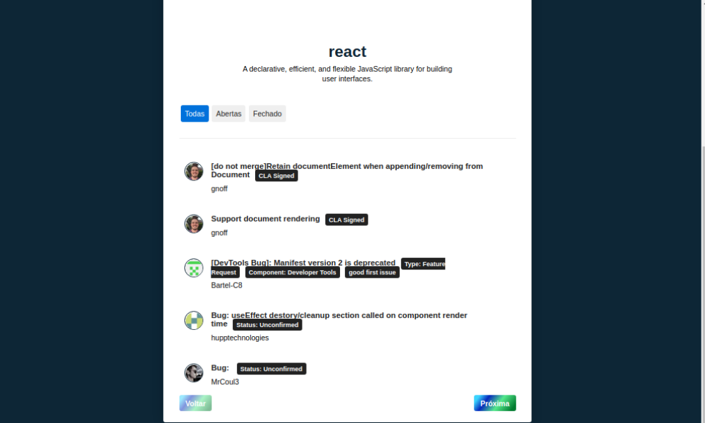

# Repos-Project

<!---Esses são exemplos. Veja https://shields.io para outras pessoas ou para personalizar este conjunto de escudos. Você pode querer incluir dependências, status do projeto e
 informações de licença aqui--->


> Projeto realizado com o consumo da API do Github. 
### :rocket: Aplication link

Link: https://repos-project.vercel.app/

### 🔧 Ajustes e alterações

✔️ O projeto foi finalizado.

- [x] Corpo do site com React;
- [x] Estilização com Styled-Components;
- [x] Requisição com AXIOS';
- [x] React-Icons; 
- [x] React Router Dom;
- [x] Responsividade;
- [x] Paginação;

### 🎮 Como projeto trabalha

O projeto consiste um Sistema que consumi a API do Github exibindo dados dos repositórios como Issues com filtros de exibição. 
O projeto foi desenvolvido com <i>React</i>.

## 👨‍💻 Tecnologias
Tecnologias e libs utilizadas no projeto:
<ul>
    <li>React</li>
    <li>Styled-Components</li>
    <li>JavaScript</li>
    <li>Axios</li>
    <li>React Icons</li>
    <li>React Router Dom</li>
</ul>

## Images


<hr>

<hr>

<hr>

<hr>

## :closed_book: Necessidades ##

Depois de iniciar :checkered_flag:, você precisa ter o  [Git](https://git-scm.com) e o [Node](https://nodejs.org/en/) instalados.

## :checkered_flag: Iniciar ##

```bash
# Clonar o projeto
$ git clone https://github.com/Thiagooffice/Repos-Project.git
# Acesse
$ cd Repos-Project
# Instalar dependências
$ yarn or npm 
# Rodar o projeto
$ yarn start
# O servidor será inicializado em <http://localhost:3000>
```
